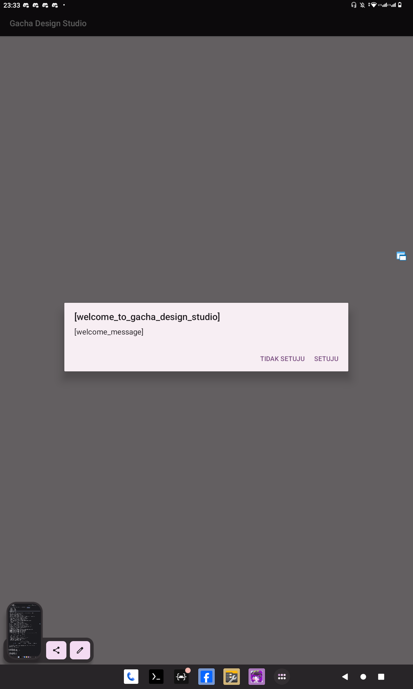
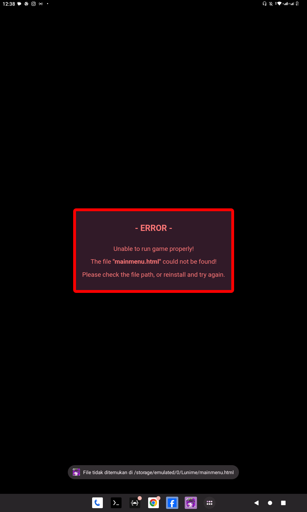
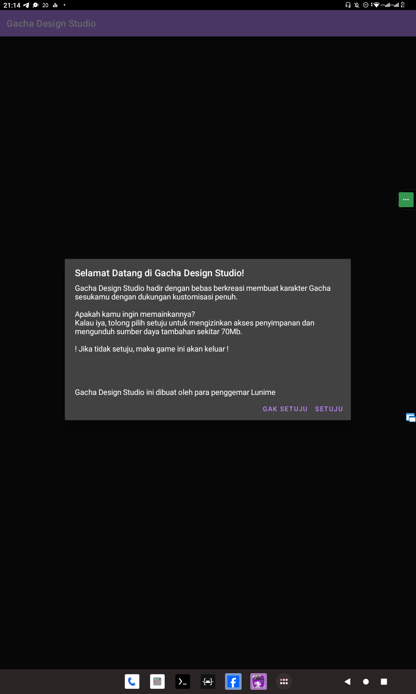
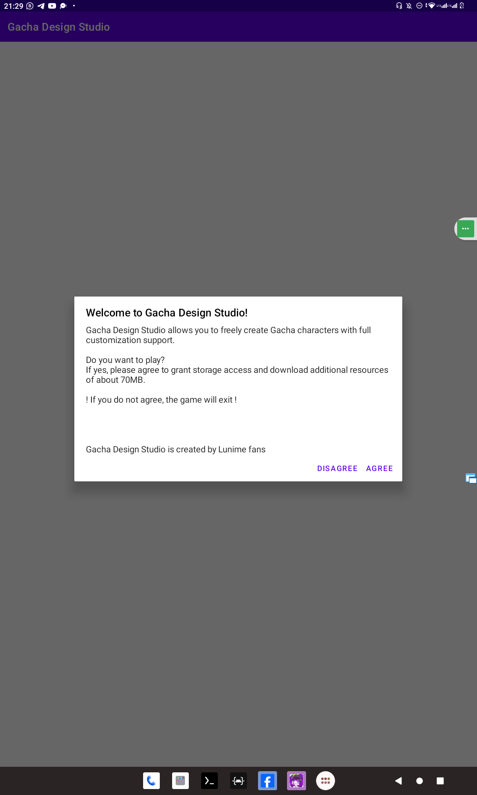
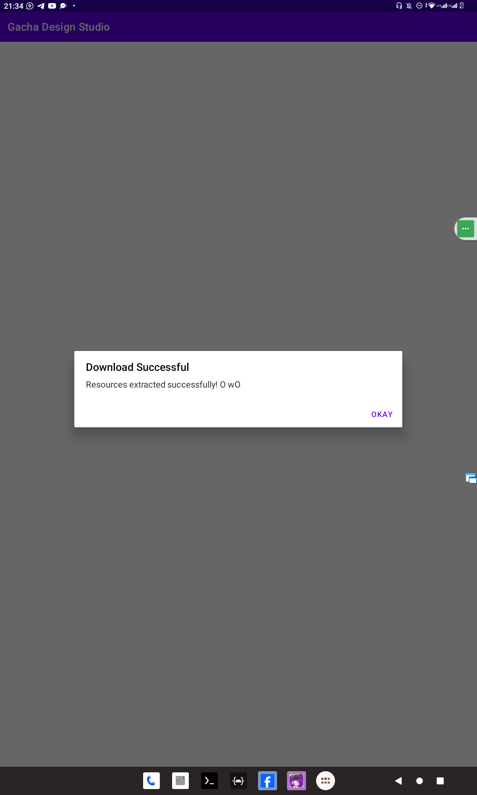
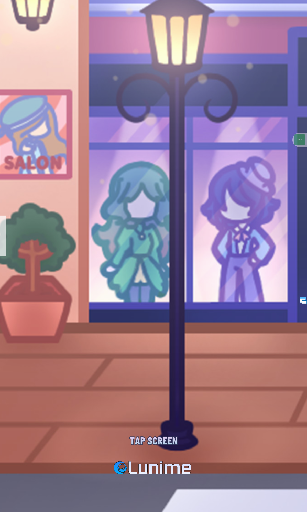

# Gacha-Design-Studio-App
Browser game semi-online khusus android untuk Gacha Design Studio dibuat oleh Lunime Fanmade (Penggemar Lunime)

# Ikon Aplikasi

# Fitur Gacha Design Studio webview
* Library write/read file (no download/upload file method)
* Download automation resource from (https://github.com/archanaberry/Gacha-Design-Studio)
* Fullscreen for Phone, Tablet, and PC
* Migration SWF (Adobe Flash Player) to HTML5 (Custom Browser)
* Server-Client protocol for sharing studiospaces enjoying friend.
* Use Vanila JS, Pure CSS, HTML5 for natively resource Gacha Game.

Game webview ini masih menimbulkan banyak bugs...
* Sudah oke ✅
* Belum difix ❌
* Sedang diperbaiki 💡

| Fitur                     | Deskripsi                                                                                                        | Status |
|---------------------------|------------------------------------------------------------------------------------------------------------------|--------|
| Tampilan WebView          | Memuat game Gacha Design Studio menggunakan WebView di dalam aplikasi Android.                                  | ✅ |
| Main Activity dan Webview terpisah              | GachaStudioMain (berguna sebagai loader sekaligus managing update resource) dengan GachaStudio (webview) dibuat terpisah agar lebih mudah dimaintain/mengurus jika terjadi suatu bug dan memungkinkan fullscreen activity.           | ✅ |
| Pengecekan Update sumber daya melalui manifest         | Memuat resource game Gacha Design Studio menggunakan pembanding file manifest lokal dengan di rawgithub (membuat seolah olah menjadi API (antarmuka program aplikasi) ) untuk melakukan update baik aplikasi nya atau resource nya.                                | ❌ |
| Alert Custom              | Menampilkan pesan alert khusus dengan judul besar dan pesan kecil, serta opsi untuk menyalin teks ke papan klip. | ✅ |
| Navigasi Mundur           | Memungkinkan pengguna untuk mundur ke halaman sebelumnya saat menekan tombol kembali di perangkat Android.       | ✅ |
| Mundurkan halaman bingkai (frame content) pakai tombol kembali        | Memungkinkan pengguna untuk mundur frame atau keluarkan window di game GDS pakai tombol back atau esc       | 💡 |
| Mengunduh resource game    | Mengunduh sumber daya dengan indikator di dialog box dan juga di notifikasi.             | ✅ |
| Keluar dengan konfirmasi dua kali klik      | Ketuk dua kali agar aplikasi dapat dikonfirmasi agar aman untuk keluar dari gane agar tidak mereset sesi game.         | ✅ |
| FullScreen                 | Merespons layar penuh untuk semua device baik ponsel atau tablet atau komputer PC.                   | ✅ |
| Tema terang gelap secara dinamis                | Merespons tema dan akan mengikuti setelan tema di setelan sistem, ini akan mempengaruhi tema di game web nya juga (dipengaruhi juga menggunakan metode fetch systemTheme())                   | 💡 |
| Exit button escape & back (untuk android)                | Merespons tombol back atau esc sebagai tombol keluar atau pause studio ketika ditekan.                   | 💡 |
| Berbagi server studio atau Menerima klien studio dari saya ke teman dan ke teman lainnya via wlan0 (hotspot/wifi rumah (server kecil kecilan))               | Merespons server dan klien untuk melalukan berbagi studiospaces kepada teman melalui wlan0 dengan IPv4 (IP versi 4) menggunakan websocket untuk menjamin real time tiap pergerakan.              | ❌ |
| Responsif                 | Merespons perubahan orientasi dan ukuran layar perangkat Android untuk tampilan yang optimal.                   | ✅ |
| Migrasi ke Skrip Kotlin untuk pengompilasi APK                 | Untuk mengganti cara kompilasi menggunakan skrip terbaru (.kts).                   | ✅ |
| Indikator pengunduhan, pengekstrakan sumber daya         | [BUG!!!] Untuk mengetahui progres pemasangan sumber daya game GDS agar tahu berapa lama dan berapa persen.       | ✅ |
| Terjemahkan secara dinamis dengan bahasa sistem (Menggunakan library ([TransVar - Translator Variable](https://github.com/archanaberry/transvar) tetapi versi Kotlin nya)                | Merespons perubahan bahasa menyesuaikan dengan bahasa lokalisasi sistem yang sedang digunakan berlangsung secara menyeluruh baik MainActivity dan Webview beserta html5 nya.              | ✅ |
| Archana Berry dan Lunime Logger Report (GachaStudioLogger.kt)                | Merespons melaporkan menjalankan game sekaligus mendebug dan melaporkan kode kesalahan dengan mudah ke pengembang ku, berfungsi baik kode inspeksi html5 web ataupun log kode aplikasi tiap berjalan (MainActivity), Peran tipe log dari Archana Berry sebagai Analisis dan Lunime sebagai Error Kerusakan !.               | ✅ |
| Archana Berry CrashAnalytic & CrashHandler             | Merespons memunculkan dialog text yang berisi laporan terhadap kode bentrok yang membuat game nya berhenti               | ❌ |
| Webview runtime engine compiled "Data Gacha resource Compiled" (.dgc file) | Implementasi pendekatan yang serupa seperti swf tetapi berguna untuk menyetabilkan dan mengompres penyimpanan sumber daya kecil kecil seperti SVG, PNG, Skrip skenario game, Skrip bingkai konten "frame<N>.js", dll. supaya lebih efisien dan lebih ringan tanpa harus diekstrak sama seperti SWF (Adobe Flash) | ❌ |
| Rencana membuat codespase alternatif github (untuk kebutuhan pengembangan tim di komunitas) | Agar kode game nya tidak ditiru dan dibuat versi lain, untuk penggunaan sumber daya boleh tidak untuk program dan skrip skenario. | ❌ |
| Integrasi JavaScript Bridge Interface        | Mnjalankan API JS ke native android sehingga menjadi menangani gameweb bisa fleksibel dan dinamis                              | ✅ |

* Kelebihan bisa berkontribusi menambahkan aset vektor lebih mudah dan terstruktur.
* Kekurangan jika gambar vektor (svg) dirender ke web dalam jumlah objek sedikit atau banyak bisa menyebabkan laggy (tiap pergerakan atau animasi atau besar kecil ukuran/resolusi gambar)

# Tangkapan layar

## Bagian pertama
  
  

## Bagian kedua
  
* Tema gelap ketika sistem menggunakan tema gelap dah bahasa Indonesia (dinamis)

* Tema terang ketika sistem menggunakan tema terang dan bahasa Inggris (dinamis)

* Ketika sumber daya file .dgc (Data Gacha resource Compiled) berhasil di download

* Lunime loading screen (Webview fullscreen)

* Tapsceeen ketika sudah selesai loading (Webview fullscreen)

## Bahasa pemrograman yang dipakai
* Tolong diperbaiki bug dari kotlin nya!

## Informasi  
Proyek ini masih dalam pengembangan dan dikerjakan secara bertahap di waktu luang.  
Kami berkomitmen untuk merancang ulang proyek ini dengan struktur yang lebih baik.  

Selain itu, kami berencana merilis game ini di Play Store apabila mendapatkan izin resmi dari Lunime.  
**Dilarang mengompilasi ulang proyek ini serta mengunggah aplikasi tanpa izin dari kami dan Lunime!**  
_Proyek game ini sedang tahap pengembangan..._

## Terimakasih untuk:

